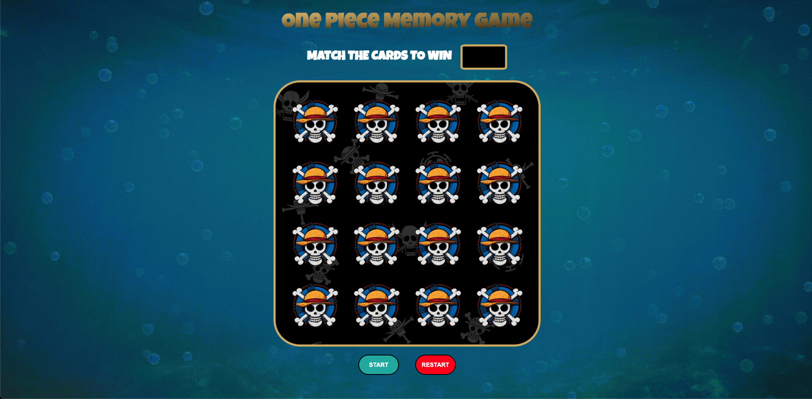

# One Piece Memory Game

## Created by: [Anthony Khong](https://github.com/anthonykhong)

### Click [Play](https://anthonykhong.github.io/concentrationGame/) to start the game

## Description

This is a browser-based memory game created using Javascript.

As a fan of the manga One Piece, I have decided to use it as the theme of this game. Furthermore, I used the jolly roger of each individual crew member as inspiration for the design of my flipped cards.

## Getting Started

1. Press <kbd>start</kbd> to initialize the game.
2. Flip the cards in order to find matching pairs.
3. If all cards are matched before the timer runs out, you win! Or else, you lose.
4. Press <kbd>restart</kbd> to play again!

## Screenshots

## Upcoming Features

<li>A start page with instructions.</li>
<li>A restart page.</li>
<li>Log number of moves the player has made.</li>
<li>Implement moves in win/loss logic.</li>
<li>Additional levels.</li>
